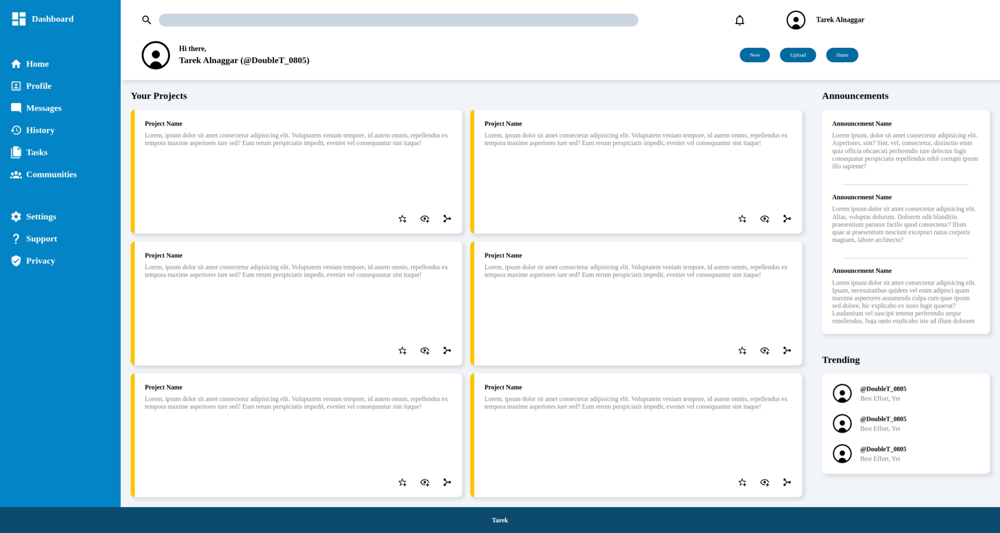

# Admin Dashboard

This project is an assignment from [The Odin Project](https://www.theodinproject.com/lessons/node-path-intermediate-html-and-css-admin-dashboard). It is an exercise in Grid and Flexbox layouts creating an admin dashboard using HTML and CSS.

## Live Demo

You can view the live demo of this project hosted on GitHub Pages: [Admin Dashboard](https://tarek0m.github.io/odin-admin-dashboard/)

## Technologies Used

- HTML
- CSS

## Getting Started

To get a local copy up and running, follow these simple steps:

1. Clone the repository:

```sh
git clone https://github.com/tarek0m/odin-admin-dashboard.git
```

2. Open the `index.html` file in your browser to view the dashboard.

## Screenshot



## Acknowledgements

- [The Odin Project](https://www.theodinproject.com/) for the assignment and resources.
